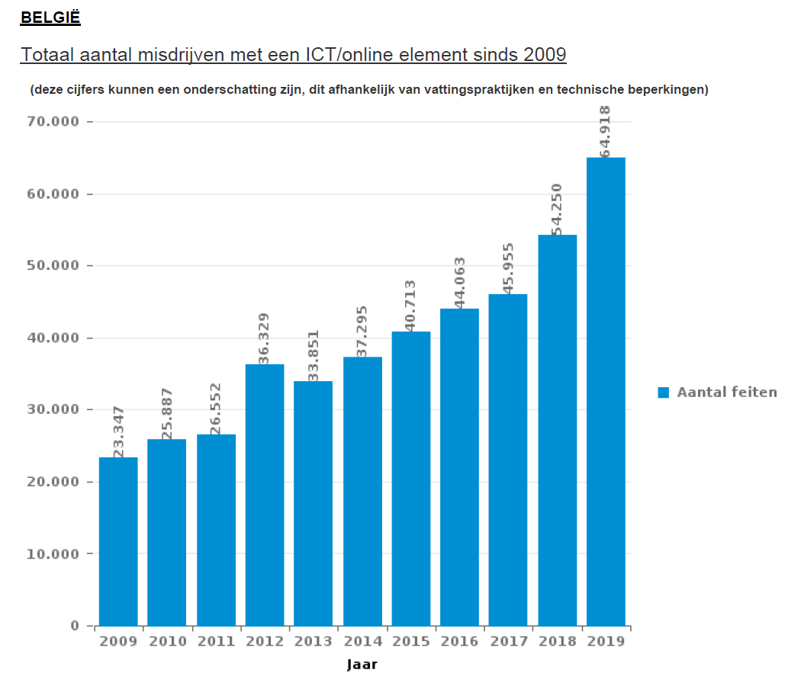
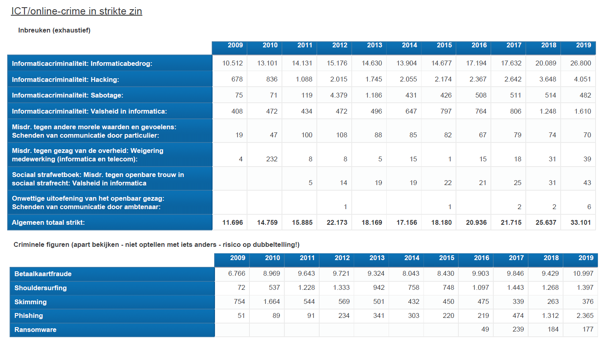

At the start of this year, the 13th of January to be precise, West-Flemish weaving machine producer **Picanol** fell victim to a large-scale **ransomware** attack. The production lines in several plants (Ypres Belgium, Romania and China) had to shut down for several days. During that time, the Picanol IT service tried to search for a solution without giving in to the demands of the hackers. Since a ransomware, in most cases, cryptographically locks you out of your system, with the only means of getting access back is to give in to the
(monetary) demands of your attacker, having a backup of your system could solve this predicament.

Incidents like this don’t exist in a vacuum, they are to be expected, and will make news headlines more frequently in the future. Because statistics don’t lie, certainly not when you look at the current trends in criminality statistics published the federal police of Belgium. These statistics are indisputably part of worldwide trend. In general though, we are doing a good job: thefts, carjacking and most other non IT related crimes are steadily dropping year by year.

The only statistic that goes against this trend is IT related crime, the *informatica-criminaliteit*. And that is only based on the reported incidents. In some areas, the IT crime is often not reported in fear or negative repercussions such as damage to brand image, consequences of the required procedures a company must follow after a such an incident and so on.

The elegant styling of the federal police aside, in the overview below, we can see the total number of (reported) crimes containing an IT element committed in the period of  2009-2019. There is a definitive rising trend, with 2009 having 23,347 cases, 2015 having 40,713 (almost double), and 2019 with an all-time high of 64,918 cases.

By law, IT crime is defined in different categories. Each have their own definitions and distinctive penalties. Next to that, the report lists statistics on criminal figures. These criminal figures cannot be counted together since one criminal fact/statistic can generate more than one criminal figure.

The four major legal categories in Belgian criminal law are as follows: hacking, *valsheid in informatica* (computer-related forgery), *informaticabedrog* (internet scams ), and sabotage.

The criminal figures used in the report are payment card fraud, shoulder surfing, skimming, phishing, and ransomware. Now we can see why we cannot make the sum of the criminal figures because, for example, skimming is specific form of payment card fraud.

Phishing barely registered over fifty cases in 2009. In 2019, the reported cases rose sharply to 2,365, representing a growth of more than 4,700% over ten years. Particularly, the number rose in both 2018 and 2019.

To not underestimate this threat is first good step in dealing with the problem: if up to 27% of people in a professional context have already dealt with hacking or phishing at least once, then the need for proper awareness and remediation presents itself.

The first line defence against phishing is spreading awareness about it. In Corona times like these, were employees overwhelmingly find themselves agreeing with statements that working from home increases the risk for falling victim to cybercrime, it is crucial for the company to warn about these threats.

### References
* [Betaalkaartfraude - Skimming – Phishing, Lokale Politie (NL).](https://www.politie.be/5423/vragen/criminaliteit-op-internet/betaalkaartfraude-skimming-phishing)
* [Cyberaanval bij Picanol: menselijke fout? Of misschien infiltratie?, Elisabeth Ackaert, vrt NWS, 15 January 2020 (NL).](https://www.vrt.be/vrtnws/nl/2020/01/15/cyberaanval-bij-picanol-hoe-geraken-hackers-binnen-bij-bedrijf/)
* [Computercriminaliteit, belgium.be (NL/FR).](https://www.belgium.be/nl/justitie/veiligheid/criminaliteit/computercriminaliteit)
* [Data News (NL).](https://datanews.knack.be/)
* [De wet van 28 november 2000 - inzake informaticacriminaliteit: aspecten van materieel strafrecht, Stefan Polakiewiez (NL).](http://www.ethesis.net/informaticacriminaliteit/informaticacriminaliteit.htm)