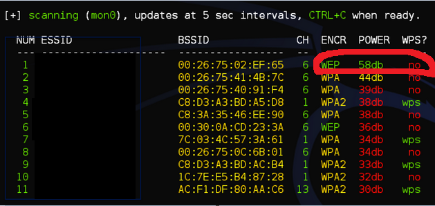
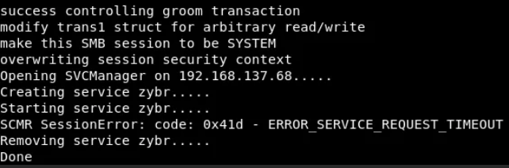
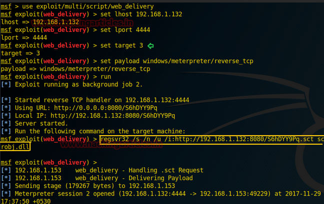
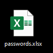

Disclaimer

-   All screenshots used in this article are mere representations and
    not the actual screenshots from the penetration test.

-   This story is my professional experience based on a client's
    request. It is illegal to penetrate a system without agreement of
    the owner.

## Introduction

I got a request to perform a black box penetration test. The client was
a multinational company with a presence in at least 5 countries. I had a
limited experience in penetration testing at that time and given the
scale of the company, I kept my expectations low. After all the
necessary contracts were signed, here was I, at square one.

The main objective of the penetration test was to see if I was able to
compromise the accounts of C level executives.

## Getting into the network

As the penetration test was a black box test, I had to find a way into
the network. At this point, the options were limited with the main
candidates being phishing, social engineering, physical infiltration,
and infiltration through Wi-Fi. As I imagined a hacker's mind set, I
took the path of least resistance (Wi-Fi).

I stationed myself on the parking of the main factory. After running a
hacking/penetration testing tool,
[Wifite](https://github.com/derv82/wifite2), I was able to detect an
open WEP access point. Retrieving the password was a matter of seconds.
Within 20 minutes, I could access to the main network.

{width="6.531944444444444in"
height="3.0944444444444446in"}

## Exploitation

Once in, I had mapped the network topology with a network scanner
(Nmap), in order to find any critical servers. The domain controller
popped out directly along with some other Windows 2012 servers. The
moment I saw Windows 2012, a vulnerability, [Eternal
Blue](https://en.wikipedia.org/wiki/EternalBlue) (MS17-010) immediately
came into my mind.

I had played around with the [Metasploit](https://www.metasploit.com/)
exploit of Eternal Blue and had mixed feelings for it as it was very
unstable and worked only 1/3 times crashing the machine the other 2/3.
This made me use
[zzz_exploit.py](https://github.com/worawit/MS17-010/blob/master/zzz_exploit.py)
instead, in combination with a regsvr32 payload from Metasploit which
leads to a meterpreter shell on the domain controller. It didn't take
more than 2 hours.

After running: ./zzz_exploit.py targetip

{width="3.9525612423447067in"
height="1.305194663167104in"}

Receiving a meterpreter shell:

{width="4.1948053368328955in"
height="2.647285651793526in"}

## The Unexpected Excel

One of the most unexpected things I encountered on the domain controller
during the penetration test was an MS excel file with the name
"passwords.xlsx" containing the credentials of multiple accounts
(private and professional) of the CEO. Mission (partially) accomplished!

{width="1.1355752405949255in"
height="1.1355752405949255in"}

To be continued in the next article.