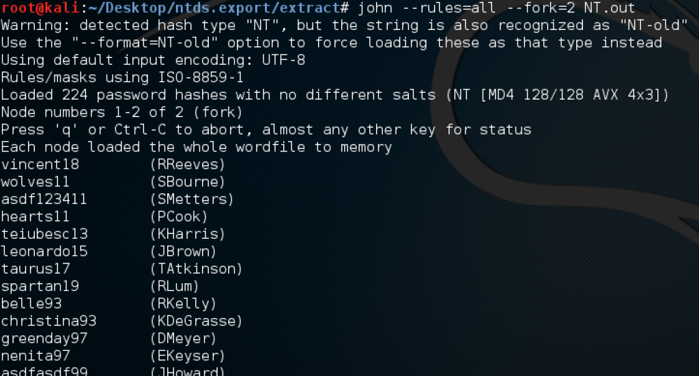
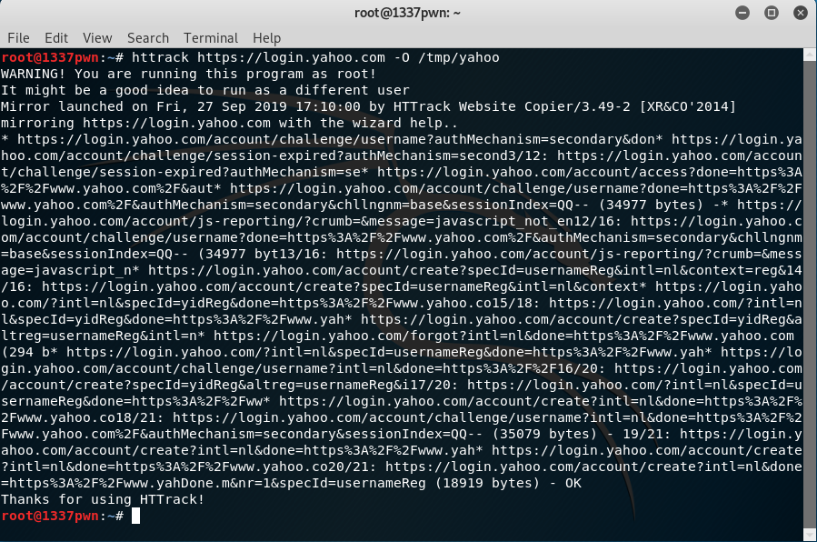
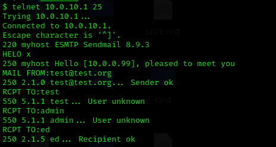
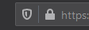

If you haven't read it yet, you can find part 1 of this story [here](https://ordina-cyber.github.io/WarStory-BlackBoxPentest/).

## Cracking the domain passwords

There were more credentials of C-level executives to be found. Since I
already had access to the Domain Controller, I decided to crack the
passwords in the domain. To achieve that, I had to create a shadow copy
of the C drive on the Domain Controller as copying ntds.dit (Active
Directory database) isn't (easily) possible without it.

The system key was also needed to retrieve the hashes, so it had to be
copied too.

After storing the hashes locally, cracking them was easy since they are
hashed by a weak format, LM. All of the above were done of course with
the help of [John the Ripper](https://www.openwall.com/john/) (cracking
tool).

## Setting up a Phishing Page

Although cracking the domain passwords of all C level executives was
successful, one of them did not reuse the same password on the
applications linked to financial transactions. So I had to devise
another plan. This made me use the almighty spear-phishing attack that
has never failed me before.

To make the attack credible, I copied an internal web page with
[HTTrack](https://www.httrack.com/) and changed the back end to log the
entered credentials.

Since I had access to the Domain Controller, I added a credible DNS A
record to point to my phishing page.

## Phishing

The phishing page was up and running. As a final step, I needed to send
the phishing link with a good story behind it. To make the story
credible, the communication had to be done from a legitimate account (or
at least what looked as a legitimate account). The company mail servers
allowed open relay. This allowed me to send a mail on behalf of a
"system administrator" asking the CFO to test the "new file sharing
system".

To make the page seem legitimate, I had also requested a HTTPS
certificate from [Let's Encrypt](https://letsencrypt.org/) so that the
URL had the "secure lock" activated.

The CFO gladly complied to the request of the "system administrator".
This way, I was able to collect the last set of credentials needed!

## Aftermath

After successfully reaching the black box penetration test goals in only
2 days, the client requested me to conduct a white box test next. Not
long after the tests, the client performed a mass-update of their
systems and migrated to the cloud. In short, they dodged the bullet (or
rather the homing missile) as they realized the exploitation path I
followed was not complex and could have been performed by even less
experienced hackers.

***Disclaimer***

-   All screenshots used in this article are mere representations and
    not the actual screenshots from the penetration test.
-   This story is my professional experience based on a client's
    request. It is illegal to penetrate a system without agreement of
    the owner