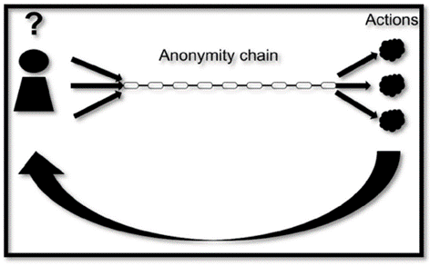
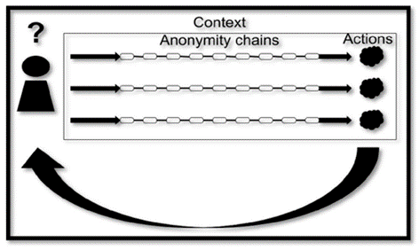
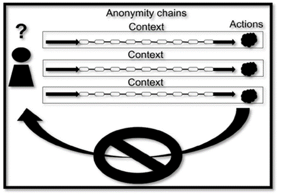

*\*This article is a re-edition of a chapter of **Panopticism Ex Machina: Practical ways to obtain anonymity, confidentiality of data and repudiability of actions on the internet and why it is necessary** (Emmanouil Perselis, 2019).*

In part 1, I explained the concept of the anonymity chain. The following images will make the concept clear.

### Using the same chain

In this scenario, the actor uses the same anonymity chain for all his actions. As a consequence, a single context is created around the actions due to the usage of the same anonymity chain, attributing them to the same unknown actor.

 
*Single anonymity chain for multiple actions*

### Using different chains but the same context

In this case, although the actor uses different anonymity chains, the actions can be correlated with each other due to the usage of the same context. This correlation is enough to attribute the actions to the same person.

 
*Multiple actions under the same context*

### Using different chains and different context

The following case should be the desired one. If the actor separates his actions through the usage of different anonymity chains and separated contexts, then each individual action will be linked to a different hypothetical person. If at some point in the future one of these actions lead to the de-anonymization of the actor, only this action will be attributed to him. This is because there is no information that can correlate these actions with each other beyond reasonable doubt. As a result, this isolates each anonymity chain from the others, and thus, the actions.

 
*Different anonymity chains and different context*

*To be continued in the next article.*