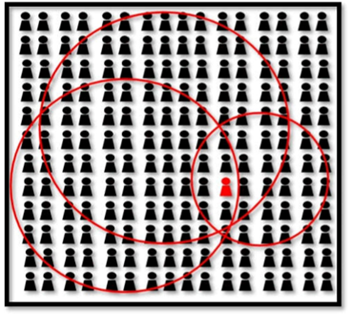

*This article is a re-edition of a chapter of **Panopticism Ex Machina: Practical ways to obtain anonymity, confidentiality of data and repudiability of actions on the internet and why it is necessary** (Emmanouil Perselis, 2019).*

## Advanced fingerprinting techniques

Most of the browser fingerprinting techniques that I explained in part 3 are limited to the actual browser. The advanced fingerprinting techniques will produce results that are linked to a certain computer or individual, even if different browsers are used. The reason is that the browser's scripting capability is used to monitor the activities of the computer or the user. The following paragraphs will briefly cover some of those techniques.

**Stylometry** is the analysis of certain writing characteristics of people. Through stylometry, it is possible to obtain information about an author deduced from a text written by him. This information can later lead to the identification of an individual. Traditionally applied to larger texts, stylometry can achieve a success rate of up to 99.29% under certain conditions, even for the attribution of instant messages. This is one of the few fingerprinting techniques that are difficult to combat with technological means.

**Mouse wheel fingerprinting** is a technique that monitors the scrolling deltas (incremental changes) as well as the speed of scrolling. Mouse speed fingerprinting is a relevant monitoring technique that monitors the speed of the motion of the mouse. Those two techniques can reveal information that is dependent on the underlying hardware used. The actual monitoring, in both cases is done by using JavaScript but can also be done by installing monitoring programs on a computer.

**Keystroke fingerprinting** is a biometrical technique used to create a profile based on biological traits of a user that affect his typing capability. The parameters taken into consideration are time related keyboard metrics collected by monitoring the typing activities of individuals.
In an experiment done in 2008 by the University of Victoria in Canada, a system was developed that analyzed several of those metrics. The system was capable of achieving a false acceptance rate of 0.0152% and a false rejection rate of 4.82%, both of which should be interpreted as extremely accurate. Even though this application is very accurate, it can only be applied through scripts in the browser or backdoored programs if prior or post access to a used computer is not possible.

**CPLJ Benchmark fingerprinting** is achieved by letting a CPU intensive script run by a browser and measure the time needed to execute it. Although this technique conveys some information about the hardware, several factors influence the results (e.g. other running programs). The most important aspect about this technique is that it uses scripts and other types of plugins delivered through the browser.

**WebRTC** is a project that gives browsers the ability of real time communication and is implemented in most modern-day browsers. Despite the fact of being useful for the development of many applications, it is also used to gather information about clients that can be used to fingerprint them. One of the main privacy concerns surrounding WebRTC is that it can be used to enumerate the local IP address as well as information related to sound and video hardware. WebRTC is also based on JavaScript, as almost all the aforementioned fingerprinting methods.

**Audio fingerprinting** is conceptually similar to HTML5 canvas fingerprinting. It works by sending a low frequency sound to the browser and then creating a fingerprint based on audio signal processing differences. A proof of concept can be found at audiofingerprint.openwpm.com/

The identification of the **graphic processor unit** is also possible. By visiting amiunique.org the WebGL renderer version was found which also contained the actual GPU model used by the testing computer.

Almost all of the aforementioned techniques are based on using JavaScript or information that is in the direct control of the user. **NoScript** is used to disable JavaScript and any other type of scripts. What concerns the remaining information, the **Tor browser** makes it as generic as possible and blocks the leakage of identifying information through the usage of TorButton (a component of the Tor browser that applies application-level security).NoScript and TorButton are part of the Tor browser used in the work-case

An analogous outcome can be achieved without the usage of the actor's browser to fingerprint the used computer. This could be done by software that is present on the operating system of the computer or installed later on. To prevent this, a trusted operating system must be used in the first place and the operating system must be reinitialized on every use. Another possible solution to the hardware fingerprinting problem could be the use of a virtual machine, but this creates more problems than it solves, leaving many clues on the host machine.

## The big picture

The essence of this part can be conceptualized by the following image. Each circle represents a piece of PII (Personally identifiable information). When the circles are superposed, they create the context in which the scope of possible actors is narrowed down. The amount of PII is inversely proportional to the scope of possible actors. This is the main reason why leakage of PII must be avoided at all cost.

*PIl relation with possible actors*

*To be continued in the next article...*