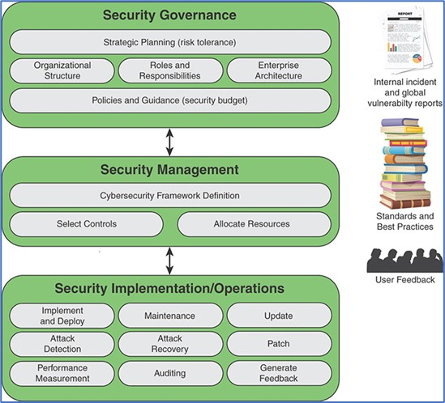

- Does the board of directors understand the organisation’s dependence on information technologies? 
- Does the organisation recognise the importance of information security and provide support at a high level? 
- Does the organisation have a security strategy?  Is this strategy aligned with the general business strategy? 
- Does the board of directors understand the potential liability in case sensitive information is compromised?

These are typical questions to be asked when you review your information security governance.

According to the NIST (US National Institute of Standards and Technology), **information security governance** is “the process of establishing and maintaining a framework and supporting management structure and processes to provide assurance that information security strategies are <u>aligned with and support business objectives</u>, are <u>consistent with applicable laws and regulations</u> through adherence to policies and internal controls, and provide <u>assignment of responsibility</u>, all in an effort to manage risk”(NIST SP 800).

Information security governance components include:
- Strategic planning
- Organizational structure
- Establishment of roles and responsibilities
- Integration with the enterprise architecture
- Documentation of security objectives in policies and guidance

Information security governance should not be confused with information security management. The information security governance should determine the mission priorities, available resources, and risk tolerance. Then management level uses this information as an input to develop security programs, and implementation/operations level executes these programs. Management level monitors and assesses security programs, and reports the outcomes of that assessments to the governance level.

*Source: Effective Cybersecurity: A Guide to Using Best Practices and Standards, William Stallings, 2018*

- Pressure to improve information security governance will continue to grow in response to:Increase in threats and vulnerabilities due to expansion of the remote workforce,
- Further digitalization of industries, 
- Necessity to adequately address the numerous legal and regulatory/statutory requirements,
- Growing cybersecurity awareness of the clients and general public.

### If you need any assistance with information security governance or have any other questions regarding cybersecurity within your company, don’t hesitate to [contact us](https://www.ordina.be/diensten/security-and-privacy/).