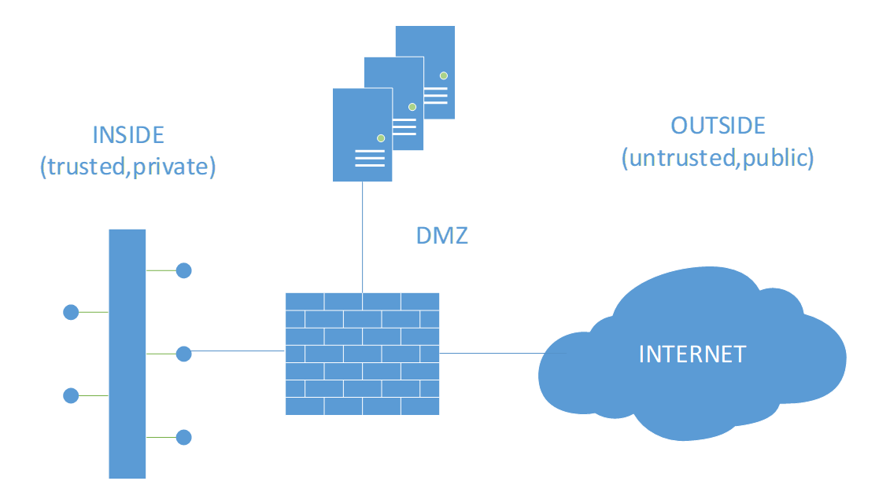

## The analogy
<i style='color:#f58220;'>If you were the person in the center of the picture, would you trust the other people to catch you? You’d say, it  depends on how well you know those people and how much you can trust them. Right?  Several factors will influence this decision making: whether people are paying attention, being ready for it, being physically up to the task, not getting scared at the last second…. The trust should not be based on hope, you’d say.</i>

## Intro – why a mindset change is needed 
In business, we still tend to see quite some IT security relying on a lot of trust: senior management, IT staff and users rarely challenge that users, claiming identities on devices, should gain full access to all (or large extent of) company data, applications, IT/OT/IoT infrastructure and networks. Often, full access is being applied with  very little (or no) level of access granularity to company data, simply because “it has always been (working) like that”.

Bad actors know this and of course take advantage of this lack of insight each and every day; newspapers only provide a glimpse of what’s going on. Still, big cases of cybercrime that were brought to the public’s attention (targeting public services/governments, critical infrastructures, large enterprises, commonly used code supply chains, cloud providers and MSPs (Managed Service Providers) and also the big crowds – you and me) seem to rarely explain the real root causes and call these ‘high profile’ / ’high tech’ complex attacks. The fact is, that those attacks mostly are not complex at all and could have easily been avoided by tackling the root cause, which can often be found in the concept of trust.

This misunderstanding of trust is still one of the biggest enablers for hackers to push through, and dates from a past when people (including IT personnel) have been taught that:
* everything inside the company network can be trusted (but should be verified) and 
* everything outside is not trusted

Even back in the days when only typical endpoints with a certain level of endpoint security resided in the corporate LAN, IT infrastructures and endpoints were primarily compromised because of the failure of this ‘trust but verify’ concept. And secondly, because of the lack of multi-layered security implementation. 

The situation even got worse: since already a decade ago, IP based endpoint devices can be anything and reside everywhere; any “smart” device with an IP address, ranging from workstations to mobile devices, IoT (Internet of Things) devices, building facilities infrastructure such as (but not limited to) lighting systems and HVAC (Heating, Ventilation, and Air Conditioning) systems, automation systems, industrial control systems, edge computing sensors, wearables, basically any public-facing IP-connecting system (not only servers) in a screened subnet or extranet …. We can go on for quite a while if you want. 

As a result, this perception that there’s still a security perimeter present between the safe inside and the unsafe ‘world wild web’ is problematic due to:
* the fact those users AND their devices haven’t been in a certain physically definable ‘trust’/inside zone anymore: they are everywhere
* the lack of layered security concepts (multiple security hurdles to take and put in series) did not make it yet to the work floor, or at least not always in a sustainable way
* the evolution of techniques used by cybercriminals, such as:
    * Spoofing: deceiving by appearing as another person or source of information 
    * Credential stuffing: stolen usernames and passwords from public data breaches (or brute force attacks elsewhere) are used to log in everywhere as password reuse is still common
    * Social engineering: human hacking using psychological pressure to gain information against you or the organization

This results in the enablement of both insider threats and external bad actors, being able to move laterally throughout the organization, once a security barrier is being compromised (for many insiders not even needed).

<i style='color:#f58220'>Thinking back to the analogy in the intro: the people that you trust to catch you, cannot be trusted because you don’t know them, you don’t know their intentions and typical behavior and you don’t even know where they are.</i>

### Need help implementing Zero Trust in your company, or are you passionate about Zero Trust and want to help others implement this way of working? Don’t hesitate to [contact us](https://www.ordina.be/diensten/security-and-privacy/).