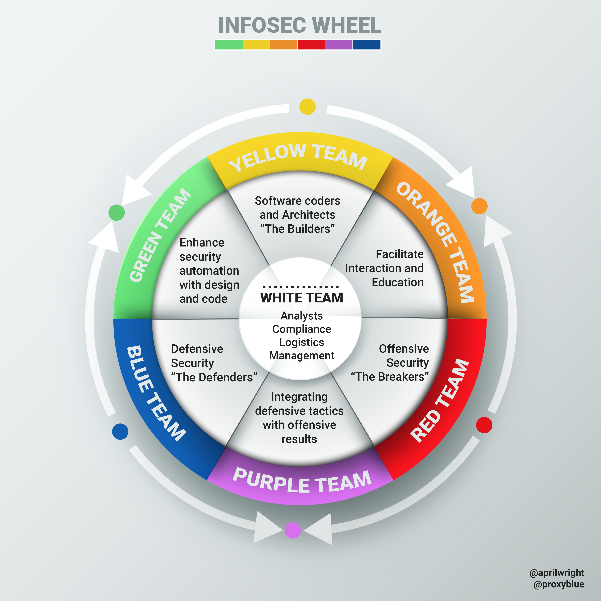

The concepts of the Red and Blue team are already well-established within organizations nowadays. However, I feel that organizations are missing out on other essential team activities that should be performed in information security. In this post, I will elaborate on how the colors in security can be extended to form a full spectrum of security teams, the so-called "color wheel of information security".

The original idea to add a third team to the model was first presented by April Wright during the 2017 BlackHat USA convention[^awright]. Louis Cremen in 2020 picked up on this talk and added some great visualizations on Hacker Noon[^lcremen].

## What about Yellow?

When we consider color basics, we see that next to red and blue, there is also yellow. If red covers the offensive security side and blue consists of the defense, then what is left to form the yellow team?

The Yellow team are the builders of the application, the developers. The trend in the cybersecurity domain has been shifting towards secure development, secure architecture, DevSecOps and overall defense in depth. However, one thing has become clear: Developers are already overworked and cannot also take up the security side of things, at least not on their own. That's why they need to be considered as part of the security model. They should not carry the burden of implementing security on their own. Keeping up to speed with security is a full-time job in its own right. Therefore, security professionals should cooperate with developers to share knowledge and expertise.

Considering developers as part of the information security model helps to create a bridge between both the developer and security worlds. It changes the conversation from "us versus them" to "we", stimulating cooperation and knowledge sharing. This way we can achieve defense in depth by building lasting relationships between teams.

## Secondary Colors - Synergies 

When talking about the Red and Blue teaming activities, we also consider the synergy between these two teams, the so-called Purple team activities. Well, if we extend our model to include the Yellow team, new synergies emerge here as well.

In the case of Yellow and Red, we get Orange. Orange teaming highlights the cooperation between the penetration testers and developers. Pinpointing which parts of the code are affected by the found vulnerabilities can provide so much more value than just offering a report as a penetration test outcome. On the other side, having the developers communicating to the penetration testers which parts of the application they are less confident in, can result in a deeper penetration test. Throughout this activity, the perception of developers being judged by penetration testers can shift to a feeling of mutual respect and cooperation.

When the Blue and Yellow teams engage in Green teaming activities, incident responders can communicate their findings on how monitoring can be improved. Which logging would be beneficial to have, is also a question that is easily solved when these teams come together. Developers on the other hand can more clearly indicate the capabilities of the system. Some hooks into the system may be unknown to the Blue team and thus may result in new ways of defending the system. 

## Blue + Red + Yellow = White?

Now that we have the primary colors included in the model, we could even go one step further and look at the combination of all colors, white. As we can see in the image Louis Cremen created, the White team consists of all activities that support the primary colors.

*Source: "Introducing the InfoSec colour wheel" by Louis Cremen on Hacker Noon[^lcremen]*

[^awright]: ["Orange is the New Purple" by April C. Wright for BlackHat USA 2017](https://www.blackhat.com/docs/us-17/wednesday/us-17-Wright-Orange-Is-The-New-Purple-wp.pdf)
[^lcremen]: ["Introducing the InfoSec colour wheel — blending developers with red and blue security teams." by Louis Cremen on Hacker Noon (Feb 21st 2020)](https://hackernoon.com/introducing-the-infosec-colour-wheel-blending-developers-with-red-and-blue-security-teams-6437c1a07700)
