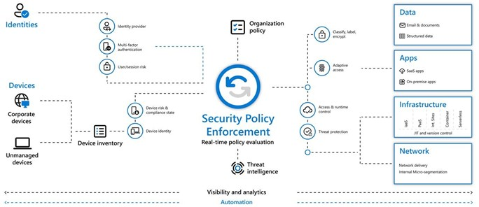

## The Zero Trust concept
Zero Trust is a framework for securing IT infrastructure and data to tackle modern digital transformation security challenges, such as:
- securing remote workers 
- hybrid cloud environments 
- move of assets and workflows between enterprise and non-enterprise infrastructure where security policy and posture are inconsistent
- privately owned BYOD devices (Bring Your Own Device)

The concept of Zero Trust Architecture can be drilled down to:
- never trust, always verify access for every resource at all time to the extent that each request for activity or access is assumed to come from an unknown and untrusted location, until verified and proven differently. 
In addition, every access request needs to be authenticated, authorized and encrypted before access to data, apps, infrastructure or networks is being granted
- automation of context collection and response: getting behavior data and context throughout all layers of the IT infrastructure layer is essential to result in accurate responses, because a security breach is always being assumed and therefore an attack chain is always detectable at different infrastructure layers
- limit the impact, once an external or inside breach occurs by isolating the breach 

## Zero Trust – how does it work?
There are many possible graphical representations of the Zero Trust concept, which can be found everywhere. 

The picture below is Microsoft’s representation and shows the key components and mutual interactions.

 
- By Microsoft’s model, security policy enforcement is done through real-time policy evaluation and active steering of several controls within the IT architecture, by checking identities controlled by 
  - the identity provider
  - MFA (Multi-Factor Authentication) 
  - the analysis of both real-time and offline sign-ins followed by a risk score calculation based on the probability that a sign-in was malicious
- devices, both corporate as unmanaged devices go into an inventory. Once device identity has been defined, a device as being allowed based on its device risk & compliance state
- threat intelligence
- the organization policy

Depending on these controls, access will be granted or denied to
- data (structured or e-mail) , based on data classification- and labelling and encryption 
- apps
- all kinds of cloud infrastructure services by using access & runtime control
- the network, by using access & runtime control steering network delivery and internal micro-segmentation
All of this is being supplied with full visibility and analytics and can be automated.

### Need help implementing Zero Trust in your company or are you passionate about Zero Trust and want to help others implement this way of working? Don’t hesitate to [contact us](https://www.ordina.be/diensten/security-and-privacy/).