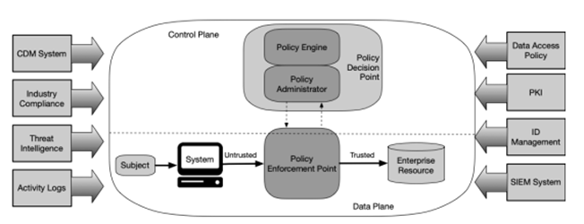

Another diagram explaining Zero Trust Architecture can be found in  [NIST Special Publication 800-27](https://nvlpubs.nist.gov/nistpubs/SpecialPublications/NIST.SP.800-207.pdf) which is by far the most global leading Zero Trust Architecture document to refer to.

## The key components described in NIST
A subject that wants to gain access to an enterprise resource using a system, by default is defined as untrusted and therefore is being denied.

A Policy Enforcement Point (PEP) is a system that monitors, enables and terminates connections between subjects and resources and gets its commands from the Policy Administrator. It’s acting as a security guard, allowing people or rejecting them to access.

A PEP can be a single “gatekeeper” component for communication paths or can be broken down to:
- a control on the client side (in general, a client on a laptop) and 
- a control on the resource side (e.g. a gateway system allowing or denying access in front of a resource

**The Policy Administrator** is responsible for establishing and shutting down communication paths between subjects and resources by sending commands to relevant PEPs. It generates session-specific authentication and authorization tokens or credentials, used by a client to access a resource. 

The **Policy Engine** ultimately decides to grant access to a certain resource for a certain subject and uses several inputs to grant, deny or revoke access:
- the enterprise policy
- **Continuous Diagnostics and Mitigation** (CDM) system that provides the Policy Engine with information about the requesting asset such as:
  - if it is running the right OS and application updates 
  - if the integrity of approved applications is preserved
  - if there is presence of non-approved components 
  - if there is any applicable subset of policies to non-enterprise devices
- **Industry Compliance** system: ensuring the enterprise remains compliant with a certain standard and manages required policies 
- **Threat intelligence** feeds: internal or external information that helps the Policy Engine making decisions
- Network and system **activity logs**: aggregation of asset logs, network traffic, resource access actions that provide (near) real-time feedback on the security posture of a system
- **Data access policies**: the attributes, rules and policies to access enterprise resources. This set of rules can be configured through a management interface or dynamically generated by the Policy Engine
- Enterprise Public Key Infrastructure (**PKI**):generating and logging certificates issued by the enterprise to resources, subjects, services and applications
- **ID management** system: creating, storing and managing user accounts and identity records (f.e. LDAP) and often utilized for artifacts associated with user accounts (such as PKI)
- Security Information and Event Management (**SIEM**) system; the collection of security related logs and alerts, normalizing these logs to interpret out relevant data and information correlation. This enables the detection of attack chains (e.g. allowing to put a risk score at certain chains of attack and activating an alert)

### Need help implementing Zero Trust in your company, or are you passionate about Zero Trust and want to help others implement this way of working? Don’t hesitate to [contact us](https://www.ordina.be/diensten/security-and-privacy/).