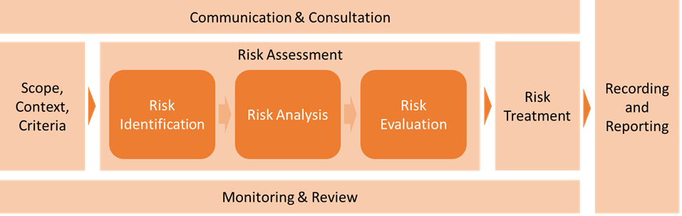

Risk.. Such a broad word nowadays.. 
Almost everyone and everything is facing ‘risks’.. People, countries, governments, companies, ..
But do you really know what risks your company is facing? Do you know what the impact (production-wise, finance-wise, reputation-wise, etc.) and the likelihood of the risks your business is facing nowadays are? Do you know if there are measures in place to reduce the impact/likelihood of a risk?

When raising the questions mentioned above to C-level, often they can list a handful of risks they know by heart. A handful, or in best case maximum the amount of 10 fingers. This statement is tending towards the freaky conclusion: The risk of not knowing the risks you are facing nowadays is actually your biggest risk.

When I explain the issue of not knowing the risks, I often get questions such as: How can we identify all these company-level risks? Are these only IT-related risks we have to tackle? What is the value of knowing all these risks? Is it valuable to know and share the risk information?

The answers to the questions are relatively straight forward if you apply a best practice of risk management system. ISO 31000:2018 is an example.

*ISO 31000:2018 Risk Management Process*

By performing a company-wide risk assessment with a pre-defined scope, you are able to identify risks of your domains. The domains are probably not only IT-related domains, but might consist out of both IT and business elements. Once you’ve identified the risks, you have to analyse and describe them, evaluate the impact/likelihood and finally develop the treatment plans including ownership of the actions. Managing in the sense of registering, owning, describing, etc. but also share information about them with relevant stakeholders.

Communication throughout the process is critical as relevant stakeholders have to be informed about the risks so one can already start thinking about preliminary high-level risk mitigation plans. Also, share the results (risks + high-level risk mitigation plans) of the company-wide risk assessment with your management because they have to be aware of all the risks their company is facing nowadays. Make sure your communication to management is business-oriented and as clear as possible to ensure they do understand the criticality and impact of the identified risks. If they better understand the risks and the corresponding business/IT impact, you are more likely to get budget and resources to treat your risks.

Ensure your risks are always closely monitored throughout the process and define the review cycle based on the risk’s criticality.

So the clearer and better communication to all kind of stakeholders in the process will bring you better results and less risks during your next company-wide risks assessment!

### If you need any assistance or have any questions regarding Risk management or cybersecurity in general, feel free to [contact us](https://www.ordina.be/diensten/security-and-privacy/).