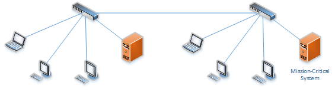
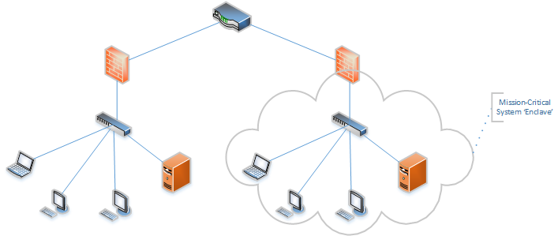
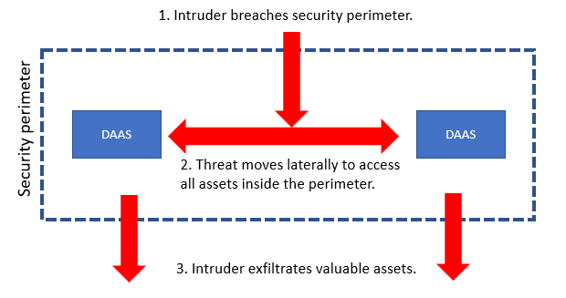
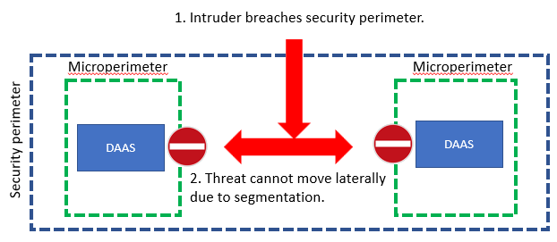

In my previous blog series “What is Zero Trust Architecture and why is it so important to understand? ”, we looked how a modern IT infrastructure should be designed based on the Zero Trust Architecture concept. One of the key foundations of the Zero Trust Architecture is the network segmentation. In this blog series, we will go into deep dive on the network segmentation.

What is network segmentation and why is it important?
=====================================================

***<u>Analogy:</u>*** ***imagine, your home consists out of one big room, and all your important and unimportant belongings are lying in that room in a unstructured chaotic way. One day, someone breaks into that house. Guess what this person is going to steal: it should be one of the most expensive things in your house.***

Flat networks vs segmented networks in a Zero Trust Architecture
----------------------------------------------------------------

Many organizations still manage a ‘flat’ network, which means all (or the vast majority) of IT assets and data are available from every system within the network from the networking perspective.

Network segmentation enables the prevention of unauthorized users, whether by curious insiders or malicious external attackers, from gaining access to valuable assets such as customers’ or employees’ PII (personal identifiable information), corporate financial records and highly confidential intellectual property, the so-called “crown jewels”. **Today, these assets are often spread across hybrid and multi-cloud environments including**

-   **private clouds**

-   **public clouds and**

-   **software-defined networks (SDNs)**

**;** all of those need to be secured against attacks.

To better understand the concept of network segmentation and why it is a basic requirement so secure all these environments against attacks, it’s necessary to consider the Zero Trust – concept in network security.

As you implement multi-layer security and automated ways to control access to different datasets and platforms (see our Zero-Trust Architecture blog), it’s key to enable your **security policy enforcement** at the networking layer: it has to be able to allow or block access to data **at a specific network location** for a specific user at a certain time, to a specific set or data located **at a specific type of network location** (please refer to my previous blog series about Zero Trust Architecture). In order to enable that, a granular definition of your different types of network-level locations is essential. This is a way of explaining network segmentation and what this blog is all about.

The result – a picture says more than a thousand words
------------------------------------------------------

At the Palo Alto Networks website ([<u>What Is Network Segmentation? - Palo Alto Networks</u>](https://www.paloaltonetworks.com/cyberpedia/what-is-network-segmentation)), there’s a great conceptual visualization, explaining the difference between:

-   an intruder breaching a security perimeter WITHOUT segmentation and controls in place between DAAS objects (data, application, asset or service)

-   an intruder breaching a security perimeter WITH segmentation and controls in place between DAAS objects (data, application, asset or service), resulting in micro perimeters blocking lateral movement

So this is why
--------------

Implementing network segmentation, with Zero Trust architecture in mind, will enable us to better safeguard the ***confidentiality*** (only accessible to intended users) and ***integrity*** (not being tampered by unauthorized users) of our data by drastically limiting lateral movement, when putting controls in place at the segment/micro perimeter level. This inherently will drive **availability** as well since better securing the ‘golden nuggets’ will decrease the risk of a system disruption and hijacking.

***“STOP BEING AFRAID OF WHAT COULD GO WRONG, AND START BEING EXCITED OF WHAT COULD GO RIGHT” – Tony Robbins***

   

### Ordina is your partner in this journey and enables you to go ahead of change against the security challenges of the digital age. If you need any assistance with cybersecurity, want training for your employees or have any questions regarding cybersecurity within your company, don’t hesitate to [contact us](https://www.ordina.be/diensten/security-and-privacy/).