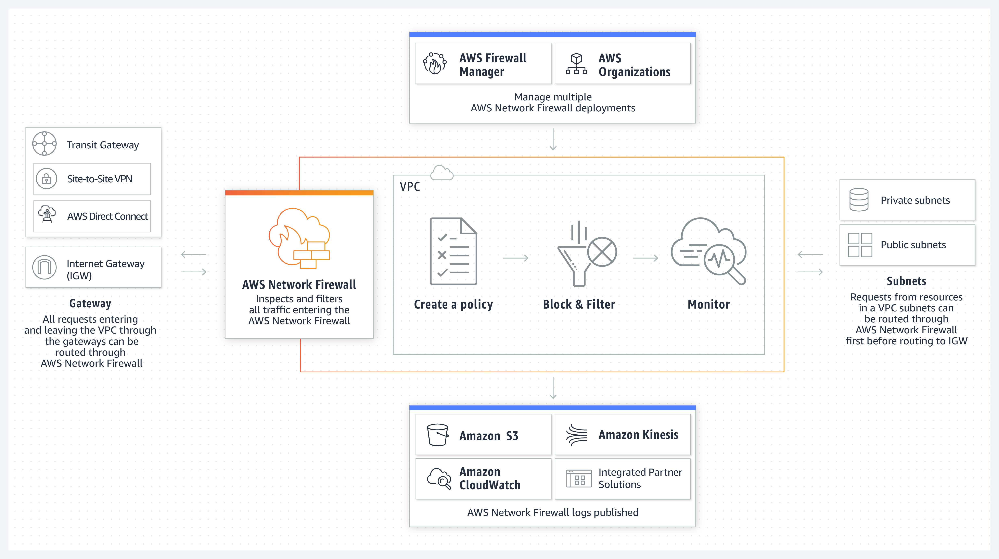

How – network segmentation examples
===================================

Network segmentation can be seen as dividing a computer network into smaller parts to improve network performance (not covering this part now) and security. Indeed, network segmentation facilitates security in the way those smaller networks can be provided with more granular controls over the data and system assets that reside in it.

One way of doing network segmentation is subdividing a company network into several **physical** parts: a larger network is broken down in **several smaller subnets** and a (physical or virtual) firewall acts as a subnet gateway, controlling which traffic comes in and goes out. A physical segmentation design is easy to understand, since the topology can be visually presented and fixed in the architecture.

**Logical segmentation** concepts have been the way to go for already many years now, creating subnets using one of the following methods:

-   virtual Local Area Networks (VLAN’s); straightforward to implement, since VLAN tagging automatically routes (actually, the correct technical term is switches) traffic to specifically intended subnets

-   network addressing schemes (IP subnets); are also an option but require a higher level of networking and routing knowledge and understanding

-   Software Defined Networks (SDN’s) and (virtual) firewalls; the modern segmentation approaches that enable – very needed - automation. Very needed, since one of the main reasons network segmentation and controls are not being implemented like they should, is because of the manual labor that change management causes in modern networking and network security. Companies are constantly changing and evolving, so networks are (or should) too, and it’s hard for a network engineering team to cope with these constant changes, while safeguarding the security controls as well.  
    Note that this requires micro segmentation (see the next chapter: segmentation vs micro-segmentation)

Logical segmentation is used more often than physical segmentation because it offers more flexibility since it doesn’t require physical re-wiring nor physical component movements. Nowadays, **automatic provisioning**, often being a functionality in Software Defined Networking environments, significantly simplifies subnet and VLAN configurations and roll-outs.

Segmentation vs micro-segmentation and perimeters 
=================================================

In some organizations, it’s preferable or even required to build so-called ‘micro-perimeters’ to define even more granular segments for some devices, applications, assets or devices than defined in the top-level segmentation design. The need to break some segments down into micro segments is depending on several parameters: the amount of sensitive information to protect, the need of treating and controlling several types of sensitive information in a different, granular way, ….

Knowing your company’s assets (systems, different classes of data and their respective data sensitivity, users and their accesses and behaviors) and the business the organization conducts (with the business risks involved) are definitely key factors influencing the decision of implementing micro-segments and their respective controls.

***Remember the one-room home burglary case in the analogy: in order to granularly define specific controls for this particular set of sensitive information (or assets), walls between the rooms can be the perimeters and a hidden vault built-in to a wall behind a painting would be a microsegment and applied granular security control (the lock and cipher combination, plus the vault fixed and hidden into the wall behind a painting).***

A great example would be to micro-segment a company that processes payment card data (causing them to go for PCI compliance) and personal identifiable information (PII, causing them to comply with GDPR).

That payment card data should be micro segmented off and granular controls and specific safeguards for this PCI-related traffic in rest and in motion should be implemented. Without micro segmentation those specific PCI-related controls cannot take place to implicitly ensure only authorized users have access to this information. The same applies to the PII data.

**An important segmentation side-note concerning cloud computing should be made here. Since organizations are massively using cloud computing, creating a hybrid network topology (combination of an on-prem IT infrastructure with a public or cloud setup), it’s important to understand classical on-prem perimeters (typically the classic on-premises edge firewalls) are not the typical terminations of the (micro-) segments any more. For IaaS and PaaS solutions, data residing and processed in specific internal segments are transported to (and again processed within) specific segments in the used cloud solution. Shifting perimeters and protection of data shifting between internal and external network segments require additional network controls and protections.** The following image (credits to Amazon) shows what this means and how this looks like in an AWS environment.

### Ordina is your partner in this journey and enables you to go ahead of change against the security challenges of the digital age. If you need any assistance with cybersecurity, want training for your employees or have any questions regarding cybersecurity within your company, don’t hesitate to [contact us](https://www.ordina.be/diensten/security-and-privacy/).