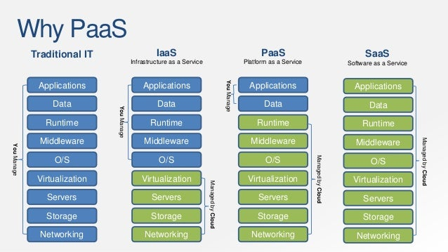

Data classification as (micro) segmentation use cases
=====================================================

Business-critical and sensitive information that could significantly harm business when exposed, compromised, altered or made unavailable is called a ‘crown jewel’ or ‘golden nugget’. Therefore, network (micro) segmentation should be based and truly inspired on a **data classification** exercise, this basically drills down to defining which type of data holds which class of data sensitivity. Multiple data classification schemes can be used, an example could be:

-   Public (data freely accessible to the public)

-   Internal-only (only accessible for internal company personnel)

-   Confidential (requires specific authorization / clearance)

-   Strictly confidential (data if compromised or accessed without authorization could lead to criminal charges, massive legal fines of cause irreparable damage to the organization)

Note: this data classification will also be needed when implementing Data Leakage Prevention solutions, but that is a different subject which will not be covered in this blog.

Not all data in rest and in transition within a company are ‘golden nuggets’, though.  
Additionally, it’s not only about protecting these ‘golden nuggets’ either.

Some examples of data classification and (micro) segmentation use cases are:

-   Guest data transported and/or tunneled through wireless networks: a company can offer Wi-Fi to visitors, external contractors, partners, etc… at relatively little risk to the company providing it. When entering this network with guest credentials, the users enter a (micro)segment that only provides internet access. Be aware of the fact that a potential risk here is, some of your visitors might generate bad traffic (due to a malware infection for example), flying under your outbound security controls to the internet, triggering a security product outside your network (for example at the receiving end), putting your company’s public IP into a blacklist. So if you are using the same public ip address for your WiFi visitors, you might end up to be blocked by a large part of the internet (websites, webapps, e-mail). So it’s always smart to use a different internet feed for your outbound visitor WiFi traffic

-   User group access: the battle against insider threats is being taken care with the ‘need to know’ principle. This is done by segmenting individual internal teams / departments into different subnets and putting network controls in place so they are only authorized to access devices, applications, assets and services they need to do their jobs. For example: someone from logistics shouldn’t be able to access certain sensitive HR data.

-   Public and hybrid cloud security: Cloud service providers are typically responsible for security at the cloud infrastructure layer itself, **but the customer is responsible for the security of the operating systems, platforms, access control, data, intellectual property (IP), source code and customer-facing content** that typically sit on top of the infrastructure. **At this level, organizations still tend to forget this and presume cloud providers take care of this, which they do NOT, resulting in severe security breaches of any kind.** Segmentation is an effective method for isolating applications in public and hybrid cloud environments and putting security controls in place where needed  
      
    

-   Initial internal M&A negotiation details

-   Sensitive financial, HR data

-   Intellectual Property (IP) data, especially important for R&D departments that develop and produce their own services and products

-   Board discussion / meeting minutes on business critical subjects

-   PII (Personal Identifiable Information)

-   IoT (Internet of Things) and OT (Operational Technology) (sub)networks.

    Automated detection and labeling has become more valuable with the growth of the Internet of Things (IoT). Also, companies using Operational Technology often use this to automate labor, mostly in (but not limited to) manufacturing and logistics. These devices are often insecure by nature (built to deliver the functionality in the most cost-efficient way, so not secure by design), and segmentation is required to isolate them from critical systems on the enterprise network. However, implementing effective IoT security requires a firewall that understands IoT protocols. Same applies to OT.

    Interesting to mention here, is that **some vendors have specific controls (often specific firewalls or firewall rulesets for several firewall vendors) to identify IoT and OT (automation) specific vulnerabilities and/or even attacks.**

-   Administrator/root passwords of IT infrastructure

-   Payment card information (PCI-DSS compliancy)

-   ….

Benefits besides security
=========================

Security is clearly a top benefit of network segmentation: by

-   subdividing the total Local Area Network (LAN) into smaller attack surfaces,

-   implementing more granular controls per network segment (depending of the specific nature of the data/systems in it) and

-   preventing lateral movement,

even when a security breach occurs, attackers are contained within the network segment they access.  
Also, more granular network monitoring provides security benefits, such as

-   troubleshooting and isolation of security incidents

-   more specific identification of security threats due to more granular and tweaked security controls

Besides the sake of network- and data security as explained above, segmentation provides a few other major benefits for organizations:

-   improved operational network (and even system) performance, as traffic will flow only where it needs to flow

-   better and more granular network monitoring: dividing your network into smaller and organized segments makes it much easier and more efficient to troubleshoot and isolate networking or system-level incidents

-   makes compliance activities much easier as strictly regulated data(flows) will be easily separated from regular data (flows): it is easier to set specific controls (defined by policies ) to data which is being kept in a different segment than to data which is sitting at the same location as the rest of the company data

### Ordina is your partner in this journey and enables you to go ahead of change against the security challenges of the digital age. If you need any assistance with cybersecurity, want training for your employees or have any questions regarding cybersecurity within your company, don’t hesitate to [contact us](https://www.ordina.be/diensten/security-and-privacy/).