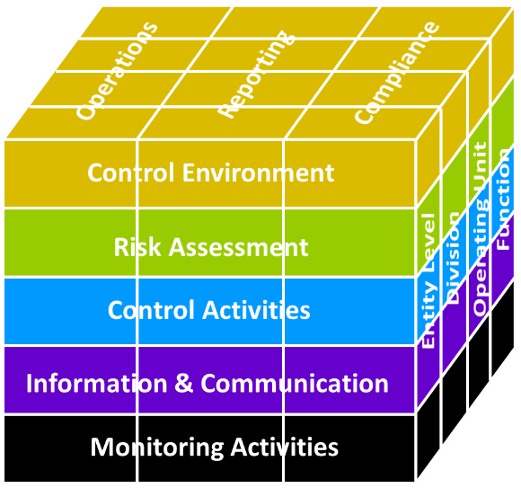

In the previous article, I explained risk may include positive risks and risk management is indivisible from the business strategy. In this article, we will think risk management from the corporate governance prospective.

## Management is Responsible for Internal Control

In the early 2000s, major accounting scandals (such as Enron scandal) occurred in the U.S., and Sarbanes–Oxley Act of 2002 (SOX) was enacted. SOX is the U.S. federal law that mandates the publicly listed companies to maintain the corporate governance and primarily aimed to save investors from accounting fraud. However its goal is not limited to such purpose and one of the key topics is internal control; <u>assessment and reporting of internal controls are required as management’s responsibility</u>.

Internal control is defined as *“a process, effected by an entity’s board of directors, management, and other personnel, designed <u>to provide reasonable assurance regarding the achievement of objectives</u> relating to operations, reporting, and compliance”* (COSO Internal Control – Integrated Framework, 2013). Internal controls consist of rules and systems to keep the business healthy and effectively, and it exists in any company more or less. <u>Security controls are also considered as internal control</u>.

SOX is applicable only to the U.S. public companies but similar law and requirements for internal control have been introduced in several countries including a few European countries. In any case, concept of internal control is appreciated by investors and therefore leading companies have maintained it.

## Risk Management is a Component of Internal Control

COSO (Committee of Sponsoring Organizations of the Treadway Commission), an initiative founded by American accounting organizations such as American Accounting Association, provides the globally used internal control framework, COSO Internal Control – Integrated Framework (2013). The internal control framework is explained as the COSO Cube.

The COSO Cube

The COSO framework provides 3 objective categories;

- Operations: effectiveness and efficiency of the entity’s operations,

- Reporting: financial and non-financial reporting and may encompass reliability, timeliness, transparency, etc. and

- Compliance: adherence to laws and regulations.

To achieve these objectives, COSO framework includes 5 components; Control Environment, Risk Assessment, Control Activities, Information & Communication and Monitoring Activates. Needless to say, Risk Assessment is a key process of risk management. Additionally, Control Activities are actions that *“help ensure that management’s directives <u>to mitigate risks</u> to the achievement of objectives are carried out”*; that is just risk treatment.

As mentioned earlier, assessment and reporting of internal controls are management’s duty. To fulfill this responsibility, risk assessment and treatment processes must be implemented for Operations, Reporting and Compliance risks. In other words, that is encouraging business managements to invest in risk management related activities including security.

## COSO Provides an ERM Framework

In addition to above listed 3 risk categories related to internal processes, companies are exposed to many types of risks (e.g. financial risks and external hazard risks) and they must be managed too. Enterprise Risk Management (ERM) is a concept defined as company-wide risk management that manages any type of risks in the company. COSO provides an ERM framework, the Enterprise Risk Management—Integrating with Strategy and Performance (2017) (COSO ERM) and it is also commonly used in leading companies. The approach is not much different from the ISO 31000:2018 Risk management — Guidelines, and the process follows Plan-Do-Check-Act cycle.

COSO ERM (2017) Components

<table>
<colgroup>
<col style="width: 20%" />
<col style="width: 20%" />
<col style="width: 20%" />
<col style="width: 20%" />
<col style="width: 20%" />
</colgroup>
<thead>
<tr class="header">
<th>Governance and Culture</th>
<th>Strategy and Objective-Setting</th>
<th>Performance</th>
<th>Review and Revision</th>
<th>Information, Communication, and Reporting</th>
</tr>
</thead>
<tbody>
<tr class="odd">
<td>
1. Exercises Board Risk Oversight

2. Establishes Operating Structures

3. Defines Desired Culture

4. Demonstrates Commitment to Core Values

5. Attracts, Develops, and Retains Capable Individuals
</td>
<td>
6. Analyzes Business Context

7. Defines Risk Appetite

8. Evaluates Alternative Strategies

9. Formulates Business Objectives
</td>
<td>
10. Identifies Risk

11. Assesses Severity of Risk

12. Prioritizes Risks

13. Implements Risk Responses

14. Develops Portfolio View
</td>
<td>
15. Assesses Substantial Change

16. Reviews Risk and Performance

17. Pursues Improvement in Enterprise Risk Management
</td>
<td>
18. Leverages Information and Technology

19. Communicates Risk Information

20. Reports on Risk, Culture, and Performance
</td>
</tr>
</tbody>
</table>

**Reference**

ISO 31000:2018 Risk management — Guidelines, https://www.iso.org/iso-31000-risk-management.html

Committee of Sponsoring Organizations of the Treadway Commission (COSO), https://www.coso.org/SitePages/Home.aspx